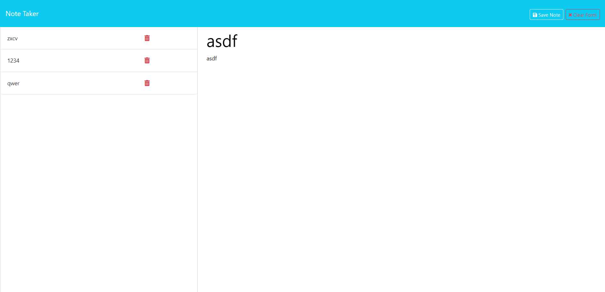

# note-taker

## Description

note-taker is an application that can be used to write and save notes with the use of an Express.js back end.

## Table of Contents

- [Installation](#installation)
- [Usage](#usage)
- [Credits](#credits)
- [License](#license)

## Installation

In order to run the application the user must have [node.js](https://nodejs.org/en/download/current) installed. Then the user must install dependencies (Express.js and uuid) by running `npm i` on the command line in the root directory of the repository.

## Usage

To use the application the user must start the server by running `npm start`.

The user must then navigate to [http://localhost:3001/](http://localhost:3001/). This will take them to the Note Taker landing page. To access saved notes and start writting new ones click `Get Started`.
Now on the notes page, the user can view saved notes by clicking on the desired title in the left pane OR delete unwanted notes by clicking the red delete button.
To add new notes the user can click the`New Note` button if the form fields are not available. Then they must enter both a note title and note text and click `Save Note`.

> Deployed application:
[https://note-taker-zet7.onrender.com](https://note-taker-zet7.onrender.com)

Screenshot of deployed application:

## Credits

[simonjbr](https://github.com/simonjbr)

[Node.js](https://nodejs.org/en)

[Express.js](https://expressjs.com/)

[uuid](https://www.npmjs.com/package/uuid)

[nodemon](https://nodemon.io/)

Deployed using [Render](https://render.com/)

## License

Please refer to [MIT license](./LICENSE) information in the repository.